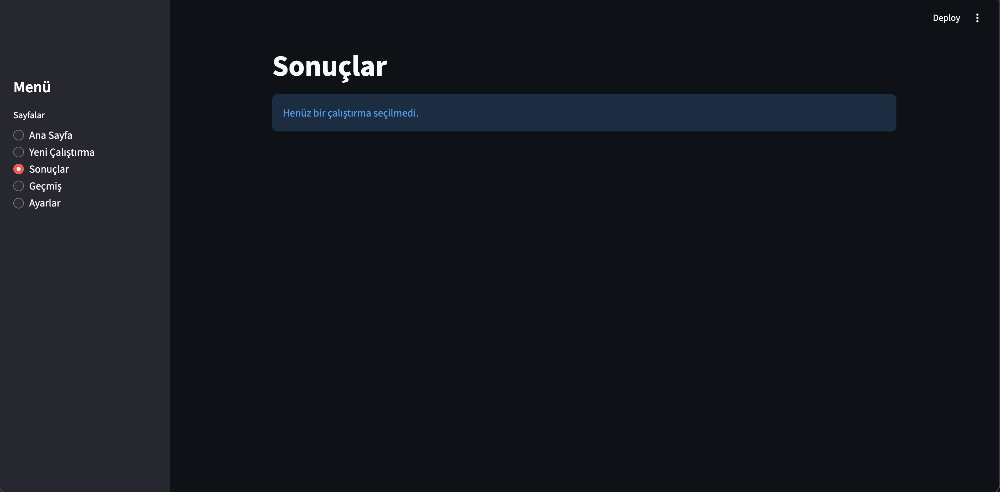

# ClarityAI — Dosya/BELGE Analizi ve Onaylı Düzeltme Asistanı

CSV tabanlı müşteri talepleri ve e-Belgelerde otomatik kontrol, rapor ve düzeltme önerisi üretir.


## 🚀 Canlı Demo

[](https://<your-app>.streamlit.app)

Demo linki: https://clarity-ai.streamlit.app/

## ✅ Ürün Değeri (Neden Farklı?)

- **Ticket/Talep Demo:** eksik bilgi tespiti, önceliklendirme, yanıt taslağı (`reply_email.txt`), rapor (`report.pdf`).
- **e-Belge Demo:** fatura-sipariş-irsaliye mutabakat kontrolleri, `issues.csv` + `report.pdf`, onay sonrası `corrected_invoices.csv`.
- **Gerçek dosya uyumu:** kolon eşleştirme + şema doğrulama ile sahaya hazır.

## 📦 Ne üretir?

**Ticket Demo:** `report.pdf`, `reply_email.txt`, (varsa) `summary.json`

**e-Belge Demo:** `issues.csv`, `report.pdf`, `corrected_invoices.csv`, `summary.json`

## 🧭 İzlenebilirlik

İzlenebilirlik (Audit Trail): Her çalıştırmada kararlar, bulgular ve uygulanan düzeltmeler `audit.json` ile kayıt altına alınır.

## 🚀 1 Dakikada Demo

**Ticket Demo**
- Yeni Çalıştırma → Ticket Demo seç
- Dosya yükle/Örnek veri seç
- Kolon eşleştir
- Kontrolleri çalıştır → Sonuç indir

**e-Belge Demo**
- Yeni Çalıştırma → e-Belge Demo seç
- `invoices.csv`, `purchase_orders.csv`, `delivery_notes.csv` yükle
- Kolon eşleştir
- Kontrolleri çalıştır → Onayla & Uygula

## 🖼️ Ekran Görüntüleri / GIF





## 🧰 Kurulum

```bash
python3 -m venv .venv
source .venv/bin/activate
pip install -r requirements.txt
```

## ▶️ Çalıştırma

```bash
streamlit run app/Home.py
```

Testler:

```bash
python3 -m pytest -q
```

## 🔐 OpenAI Anahtarı (Opsiyonel)

```bash
cp .env.example .env
```

`.env` içine:

```
OPENAI_API_KEY=your_key_here
```

- Varsayılan mod: Offline
- OpenAI, ayarlardan opsiyonel açılır.
- **Güvenlik:** `.env` git'e girmez, anahtar asla repoya konmaz.
- Deploy aşamasında secrets kullanılması önerilir.

## 📄 Veri Formatları

**Ticket Demo (zorunlu):**
- `ticket_id`, `created_at`, `channel`, `customer_text`
- Opsiyonel: `category`, `order_id`, `amount`

**e-Belge Demo:**
- `invoices.csv`, `purchase_orders.csv`, `delivery_notes.csv`
- Kolon eşleştirme ile farklı isimler desteklenir.

## 🧠 Mimari

- `core/`: audit, schema, storage, LLM, engine
- `plugins/`: demo kuralları ve çıktı üretimi
- `app/`: Streamlit arayüzü

Detay: `docs/architecture.md`

## ☁️ Deploy (Streamlit Cloud)

- **Main file path:** `app/Home.py`
- **Secrets (TOML) örneği:**

```
OPENAI_API_KEY="..."
OPENAI_MODEL="gpt-4o-mini"
```

- `.env` Streamlit Cloud'da kullanılmaz, secrets kullanılmalıdır.

## 💾 Kalıcılık Notu

Streamlit Cloud'da dosya sistemi kalıcı değildir; `runs/` geçmişi garanti edilmez.

Lisans: No license / all rights reserved
